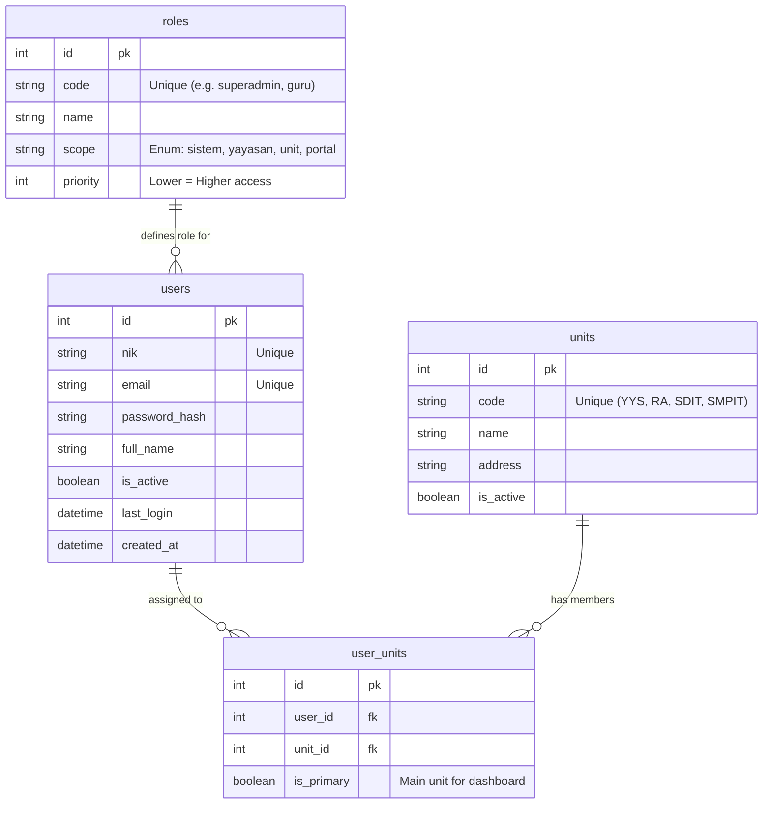

# Database Schema Design - Asy-Syuuraa Batam

> **Status:** Draft (Sprint 1)
> **Engine:** PostgreSQL (Production) / SQLite (Local Dev)
> **ORM:** SQLAlchemy

## 1. Authentication & RBAC (Core)

Modul ini menangani user management, role, dan pembagian akses berdasarkan unit sekolah.

### ER Diagram

### Table Definitions

#### `roles`
Tabel referensi untuk semua role yang ada di sistem.
- **code**: Identifier unik untuk di code (e.g., `superadmin`, `kepala_unit`).
- **scope**: Menentukan batasan akses data (`sistem`, `yayasan`, `unit`, `portal`).

#### `units`
Daftar unit pendidikan dan yayasan.
- **code**: `YYS`, `RA`, `SDIT`, `SMPIT`.

#### `users`
Tabel utama pengguna.
- **nik**: Nomor induk (bisa NIK KTP atau NIK Yayasan/Sekolah). Digunakan untuk login selain email.
- **role_id**: Role utama user (misal: Guru).

#### `user_units`
Tabel pivot untuk *Many-to-Many* relationship antara User dan Unit.
- Memungkinkan satu guru mengajar di SDIT dan SMPIT sekaligus.
- `is_primary`: Menentukan dashboard mana yang muncul saat login pertama kali.
